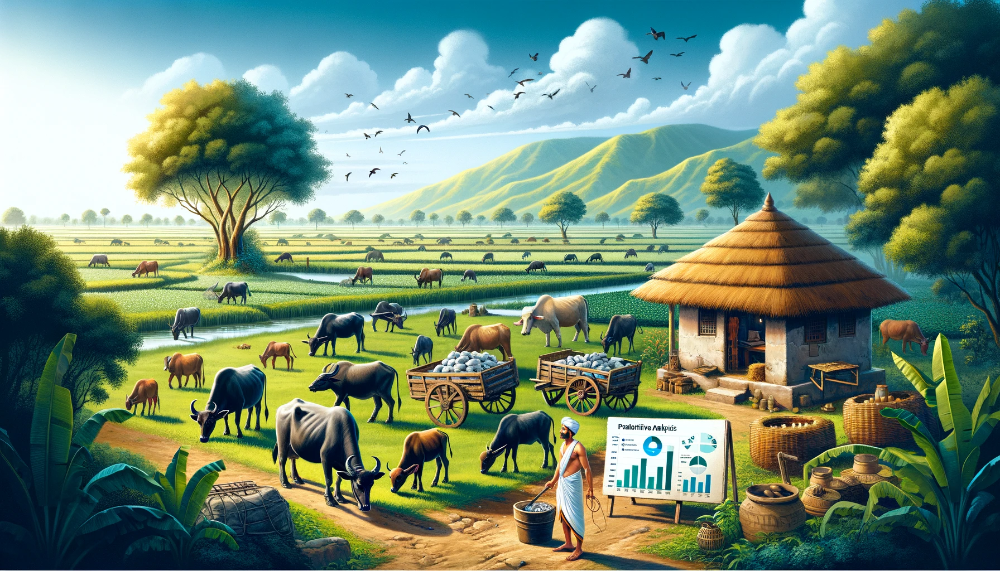

<h1 align="center">
  <strong>Dairy Farm Productivity Analysis in Gujarat</strong>
</h1>

  

## Introduction

**Project Overview:** This project focuses on analyzing dairy farm productivity in Gujarat using statistical models. We've gathered detailed datasets from various Gujarat Dairy Farms, emphasizing variables crucial for understanding the intricacies of dairy farming.

---

## Contents

1. **Dataset Summary**
   - **Objective:** Analyzing dairy farm productivity and economic factors in Gujarat.
   - **Method:** Survey via Google Forms; 300 responses from 500 dairy farmers.
   - **Content:** Data on milk production, costs, revenue, government support satisfaction.
   - **Confidentiality:** Anonymity of respondents maintained.

2. **Variables List**
   - Includes numerical data (livestock count, milk production, financial metrics) and categorical data (farm location, satisfaction ratings).

3. **Data Cleaning and Preparation**
   - **Initial Assessment:** Understanding the structure and contents.
   - **Handling Categorical Variables:** Conversion to dummy variables for regression analysis.
   - **Data Cleaning:** Removal of NA entries, normalization of time-related variables.

4. **Statistical Analysis**
   - **Normality Check and Transformations:** Addressing skewness in milk production data.
   - **Initial Model Formulation:** Defining the regression model with various predictors.

5. **Regression Results**
   - **Model Efficacy:** R-squared and adjusted R-squared values.
   - **Significance of Variables:** Analysis of coefficients for predictors like livestock count, financial metrics.
   - **Multicollinearity Concerns:** Addressing high intercorrelations among independent variables.

6. **Revised Model with Balance Money per Day**
   - **Addressing Multicollinearity:** Introduction of 'Balance Money per Day' variable.
   - **Statistical Significance and Model Fit:** Analysis of the revised model's performance.

7. **Hypothesis Testing for Location and Government Satisfaction Variables**
   - **Statistical Tests:** Examining the significance of location and government satisfaction levels in milk production.

8. **Correlation and Model Interpretation**
   - **Inter-Variable Correlation:** Assessing relationships among variables.
   - **Overall Model Interpretation:** Determining major predictors of milk production.

9. **Diagnostic Plots and Outlier Analysis**
   - **Residual Analysis:** Evaluating model assumptions and identifying outliers.

10. **Model Building with Forward Selection**
    - **Methodology:** Using the Forward Selection method to build the regression model.
    - **Key Variables Identification:** Determining significant predictors for milk production.

11. **Final Model Analysis**
    - **Model Overview:** Explaining variability in milk production.
    - **Key Findings:** Insights on livestock counts, investment in animal health, and revenue implications.

12. **Strategic Implications for Dairy Farming**
    - Recommendations for investment and resource allocation in dairy farming based on the study's findings.

---

## Detailed Conclusion

The comprehensive statistical analysis conducted in this project offers valuable insights into the intricate dynamics of dairy farming in Gujarat. The study unveils critical factors influencing milk production, which hold significant implications for the dairy farming sector through meticulous data cleaning, preparation, and rigorous regression analysis.

Key findings reveal the direct correlation between the number of cows and buffaloes on a farm and increased milk production. Financial aspects like daily revenue and expenditures on animal health emerge as significant contributors, highlighting the role of strategic investment and resource management in the dairy industry.

The study's nuanced understanding of economic trade-offs in dairy farming, the role of location-based and governmental support factors, and the sophisticated use of diagnostic plots and outlier analysis further strengthen the reliability of the findings. This project serves as a blueprint for strategic decision-making in dairy farming, guiding policy-making and driving innovation in the dairy sector.

---

## Resources

  - **Data Cleaning Code:** [Data Cleaning](STAT371_Cleaning.ipynb)
- **Full Report:** [Report.pdf](Report.pdf)
- **Visuals, Code, and Outputs:** [Code with Outputs](FP_OLS.ipynb)
